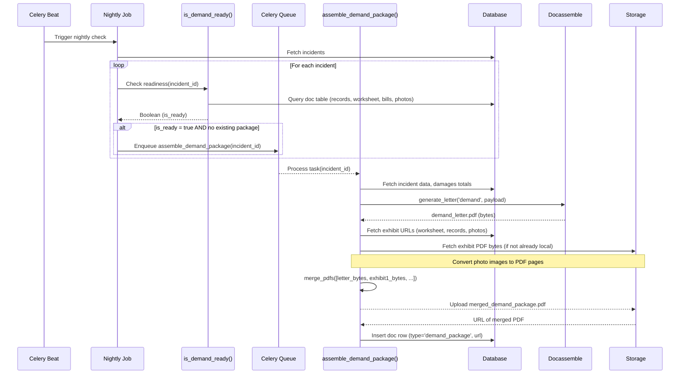
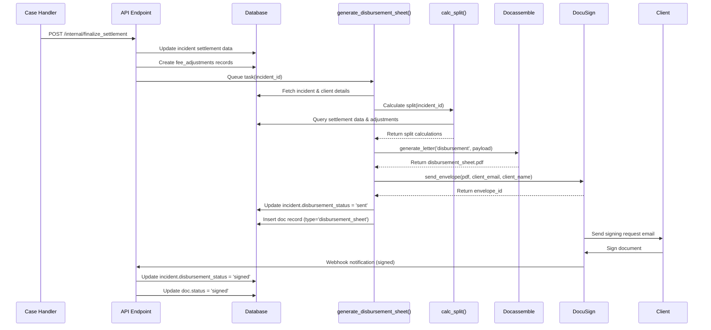

## Automated Demand Package Assembly (Planned)

This flow will describe the process of automatically assembling a demand package once all necessary documents for an incident are available.

1.  **Trigger**: A nightly scheduled job (Celery Beat) will periodically scan incidents.
2.  **Condition Check**: For each relevant incident, a utility function (`utils.package_rules.is_demand_ready`) checks if all prerequisites for a demand package are met:
    *   Existence of medical records document(s).
    *   Existence of a generated damages worksheet (PDF).
    *   Existence of all associated provider medical bills.
    *   Existence of at least one liability photo.
    *   Absence of an existing `demand_package` document for the incident.
3.  **Task Queuing**: If an incident is ready, the `assemble_demand_package` Celery task is queued for that incident.
4.  **Package Assembly (`assemble_demand_package` task):
    *   **Fetch Data**: Gather necessary data for the incident (client details, incident specifics, damages totals from the worksheet).
    *   **Generate Demand Letter**: Call an external service (e.g., Docassemble via `externals.docassemble.generate_letter`) to create the main demand letter PDF using the fetched data.
    *   **Collect Exhibits**: Retrieve the PDF versions of:
        *   Damages Worksheet.
        *   Consolidated Medical Records.
        *   Liability Photos (converted to PDF pages if necessary).
        *   (Potentially other documents like policy information - TBD).
    *   **Merge PDFs**: Use a utility (`utils.pdf_merge.merge_pdfs`) to combine the generated demand letter and all exhibit PDFs into a single `demand_package.pdf`.
    *   **Upload & Record**: Upload the merged PDF to the cloud storage bucket and create a new `doc` table entry with `type = 'demand_package'` and the URL of the uploaded file.
5.  **Outcome**: A complete demand package PDF is stored and linked to the incident.

## Document Processing (Medical Bill Example)

## Settlement and Disbursement Flow

This flow describes the process of finalizing a settlement, automatically calculating the disbursement amounts, generating a disbursement sheet, and sending it to the client for e-signature.

1. **Trigger**: A settlement offer is accepted and the case handler calls the `/internal/finalize_settlement` API endpoint with settlement details.
2. **Settlement Data Storage**:
   * Update the `incident` record with `settlement_amount`, `lien_total`, and set `disbursement_status = 'pending'`.
   * Create `fee_adjustments` records for any custom deductions or credits.
3. **Task Queuing**: The API endpoint queues the `generate_disbursement_sheet` Celery task for the incident.
4. **Disbursement Sheet Generation** (`generate_disbursement_sheet` task):
   * **Fetch Data**: Retrieve incident and client details from the database.
   * **Calculate Split**: Call `utils.disbursement_calc.calc_split()` to compute the settlement division:
     - Gross settlement amount
     - Attorney fee (based on attorney_fee_pct)
     - Lien total
     - Other adjustments (sum of fee_adjustments.amount)
     - Net to client (gross minus deductions)
   * **Generate PDF**: Call Docassemble via `externals.docassemble.generate_letter('disbursement', payload)` to create the disbursement sheet PDF.
   * **Send for Signature**: Send the PDF to DocuSign via `externals.docusign.send_envelope()` for client e-signature.
   * **Update Status**: Set `incident.disbursement_status = 'sent'`.
   * **Record Document**: Create a new `doc` record with `type = 'disbursement_sheet'` and the DocuSign envelope ID.
5. **E-Signature Process**:
   * Client receives an email with a link to sign the disbursement sheet.
   * Client reviews and signs the document.
   * DocuSign sends a webhook notification to the API when signed.
6. **Post-Signature Actions**:
   * Update `incident.disbursement_status = 'signed'`.
   * Update the document status.
   * Potentially trigger funds release process (future feature).

This flow extends the case management timeline from settlement to disbursement sheet and creates the foundation for the funds release process.
