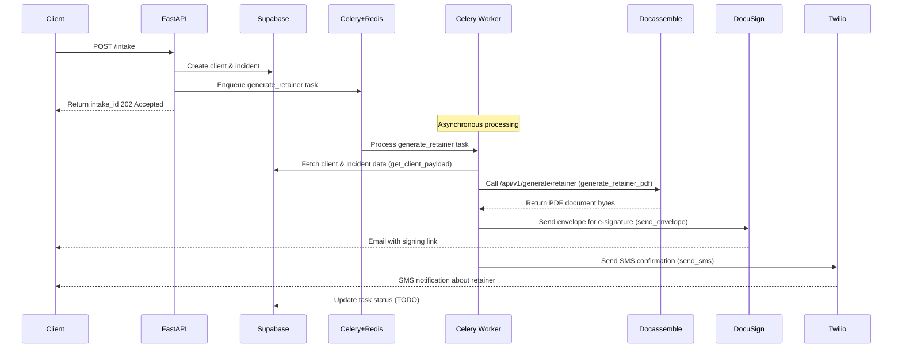
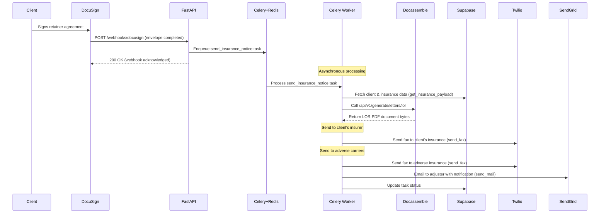
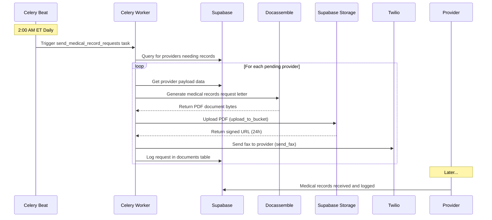

# Process Flows

This document outlines the key process flows in the PI Automation system.

## Client Intake and Retainer Generation

The following sequence diagram shows the flow of data from the client intake API
through Celery for asynchronous processing, Docassemble for document generation,
and DocuSign for e-signature.

## DocuSign Webhook and Insurance Notice Flow

The following sequence diagram shows the flow after a client signs a retainer agreement,
triggering the automatic generation and delivery of Letters of Representation (LOR) to insurance carriers.

## Nightly Medical-Records Request Flow

The following diagram shows the automated nightly process for sending medical record requests to healthcare providers who haven't sent records yet.

